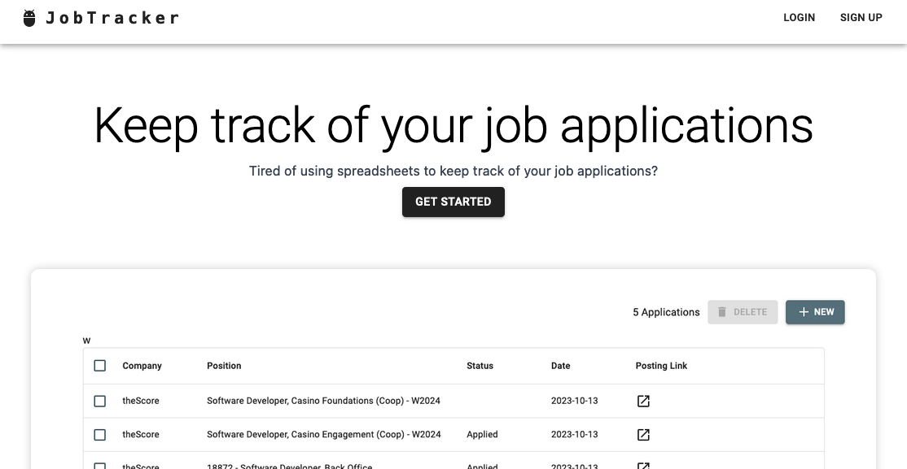
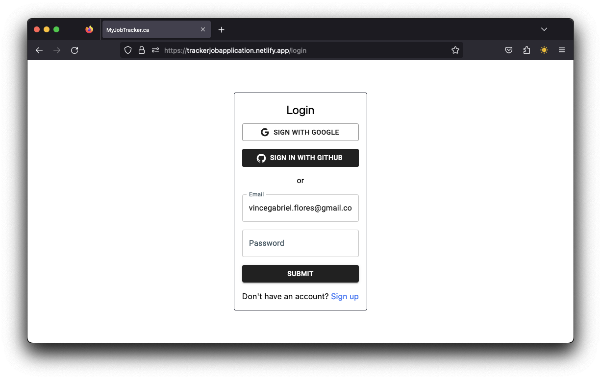
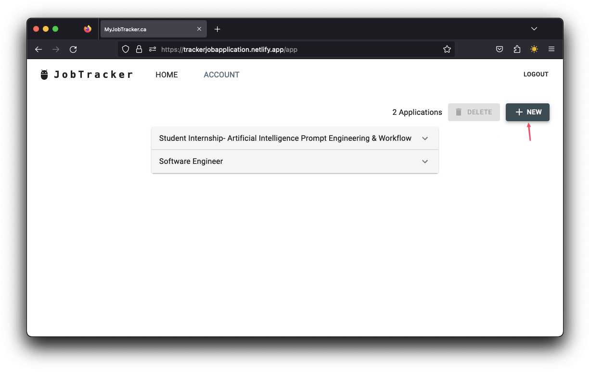
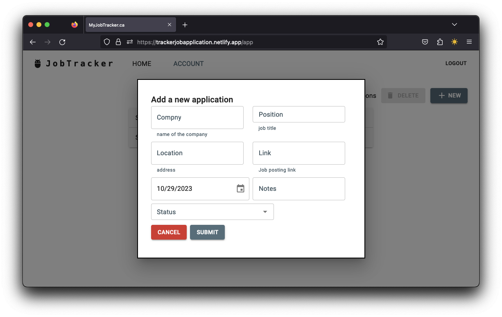

# Job Application Tracker

## Description

An application to keep track of coop/internship/job applications that is easy to use and accessible anywhere and anytime. This is for students who are currently looking for their first internships/jobs. 

## Table of Contents (Optional)

If your README is long, add a table of contents to make it easy for users to find what they need.

- [Job Application Tracker](#job-application-tracker)
  - [Description](#description)
  - [Table of Contents (Optional)](#table-of-contents-optional)
  - [Installation](#installation)
  - [Usage](#usage)
    - [Create an Account or Log in](#create-an-account-or-log-in)
    - [To add a new application click on New](#to-add-a-new-application-click-on-new)
  - [Credits](#credits)
  - [License](#license)
  - [Badges](#badges)

## Installation

The live website is available at [here](https://trackerjobapplication.netlify.app/)

## Usage

### Create an Account or Log in

### To add a new application click on New

## Credits

I developed this myself, feel free to check out my profile 
at [here](https://github.com/vinceflores)
## License

The last section of a high-quality README file is the license. This lets other developers know what they can and cannot do with your project. If you need help choosing a license, refer to [https://choosealicense.com/](https://choosealicense.com/).

---

## Badges

Badges aren't necessary, per se, but they demonstrate street cred. Badges let other developers know that you know what you're doing. Check out the badges hosted by [shields.io](https://shields.io/). You may not understand what they all represent now, but you will in time.

